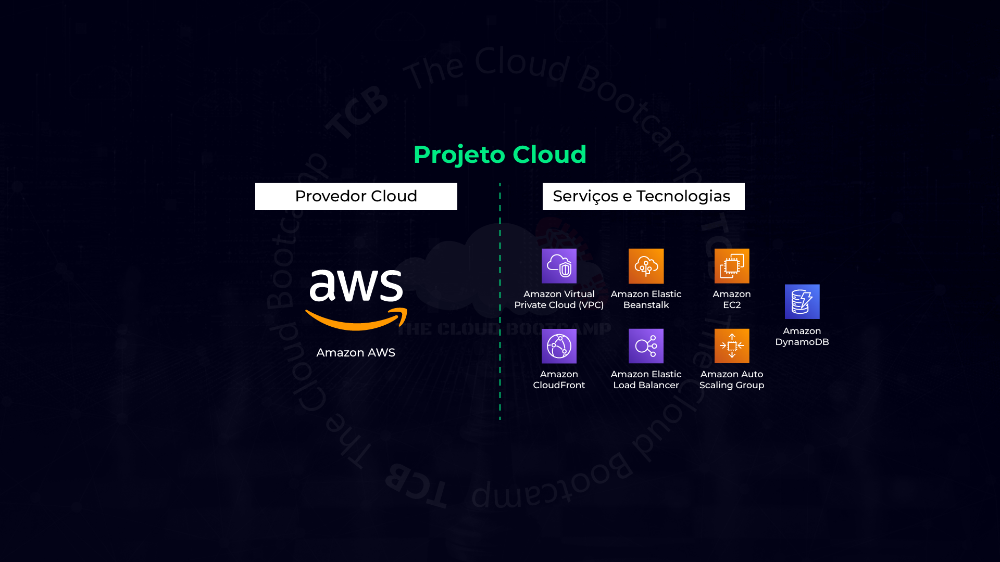
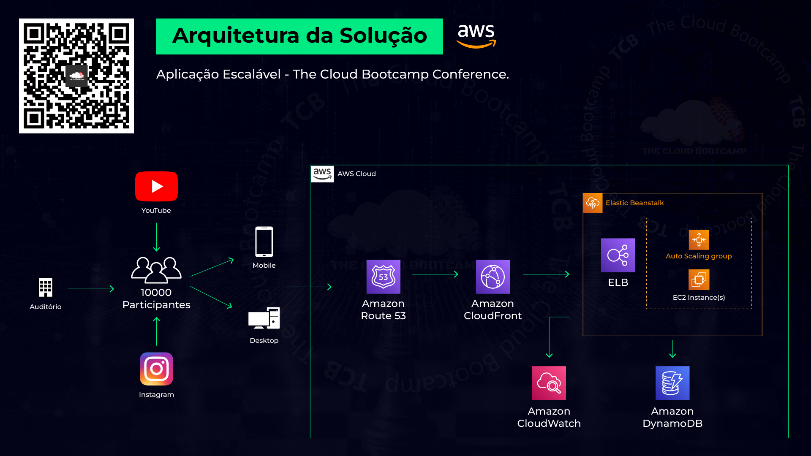
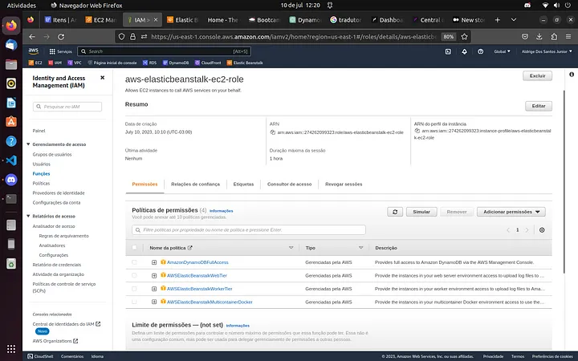
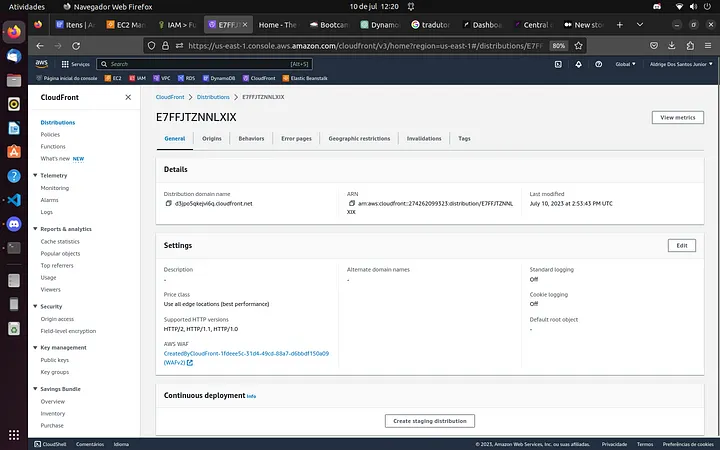
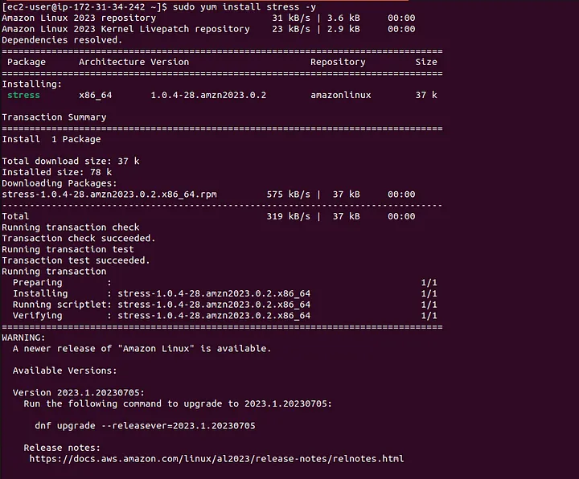
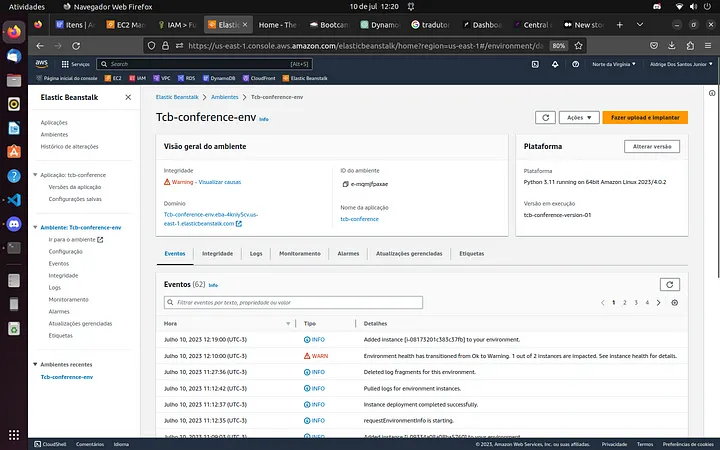
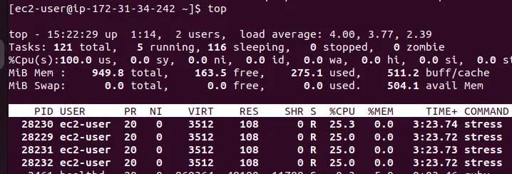
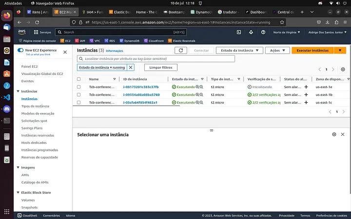
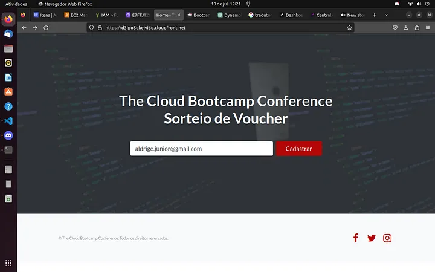
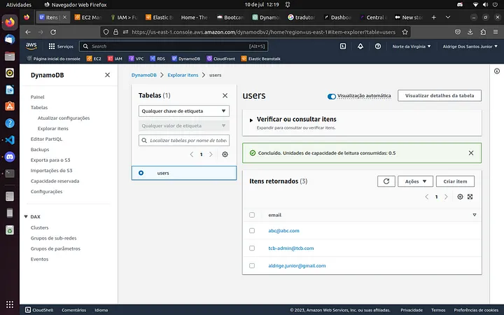

  <h1 align="center">Implementação de uma Aplicação Web Escalável utilizando os serviços do Elastic Beanstalk, DynamoDB, CloudFront e Edge Location da AWS</h1>

## Descrição do projeto:
Nesse projeto baseado em um cenário do mundo real, fui responsável por implementar uma aplicação que precisa suportar a alta demanda de um grande número de usuários acessando simultaneamente. Esta aplicação foi utilizada em uma grande conferência que contou com mais de 10.000 pessoas, presencialmente e online, contando com participantes de todo o mundo.

O evento foi transmitido pela internet e presencialmente e foram sorteados 10 vouchers para 3 certificações de Cloud. Nesse momento os mais de 10.000 conferencistas cadastraram seus e-mails para garantir a participação no sorteio.

Na AWS, foram utilizados os serviços do Elastic Beanstalk para deploy da aplicação web, DynamoDB para armazenar os e-mails, CloudFront para fazer o caching dos arquivos estáticos e dinâmicos em uma Edge Location próxima ao usuário.

Parte 1: Implementando DynamoDB + Elastic Beanstalk (EC2, SG, ELB, TG, AutoScaling…)

- DynamoDB (Table)

• Name: users
• Partition key | Primary key: email

- Revisar recursos criados: EC2, SG, ELB, TG, AutoScalling

- Elastic Beanstalk | Validar roles ‘elastic’ criadas…

Create application

Step 1 — Configure environment

Environment tier
(*) Web server environment

Application information
Aplication Name: tcb-conference

Platform
Platform: Python
Platform version: (Recommended)

Application code
Upload your code
Version label: tcb-conference-version-01
(*) Public S3 URL:
https://bootcamp-aws.s3.amazonaws.com/tcb-conf-app.zip

Presets
Configuration presets
(*) High availability

Next

Step 2 — Configure service access

Service access
(*) Create and use new service role | 02 roles serão necessárias “service” e “ec2”

‘Service’ role name: aws-elasticbeanstalk-service-role

[View service role permissions ]

► aws-elasticbeanstalk-service-role

Permissions:

- AWSElasticBeanstalkEnhancedHealth
- AWSElasticBeanstalkManagedUpdatesCustomerRolePolicy

Trust relationships

{
“Version”: “2012–10–17”,
“Statement”: [
{
“Effect”: “Allow”,
“Principal”: {
“Service”: “elasticbeanstalk.amazonaws.com”
},
“Action”: “sts:AssumeRole”,
“Condition”: {
“StringEquals”: {
“sts:ExternalId”: “elasticbeanstalk”
}
}
}
]
}

EC2 key pair: ****

E vamos criar a ‘EC2 instance profile’:

IAM | Roles | Create Role | Trusted entity type: AWS service

Common use cases: EC2

Next

Add permissions

- AWSElasticBeanstalkWebTier
- AWSElasticBeanstalkWorkerTier
- AWSElasticBeanstalkMulticontainerDocker

Next

Role name: aws-elasticbeanstalk-ec2-role
Select trusted entities

Trust relationships

{
“Version”: “2012–10–17”,
“Statement”: [
{
“Effect”: “Allow”,
“Action”: [
“sts:AssumeRole”
],
“Principal”: {
“Service”: [
“ec2.amazonaws.com”
]
}
}
]
}

Create role
Refresh…

Next

Step 3 — Set up networking, database, and tags

Virtual Private Cloud (VPC): N. Virginia — Default VPC

Instance settings
Public IP address
[ ✔ ] Activated
Instance subnets
Availability Zone: All.

Next

Step 4 — Configure instance traffic and scaling

Instances

Root volume type: General Purpose (SSD)
Size: 10 GB

Capacity
Auto scaling group
Load balanced
Min: 2
Max: 4
Fleet composition: (*) On-Demand instances
Instance types: t2.micro

Scaling triggers
Metric: CPUUtilization
Unit: Percent
Min: 1
Min: 1
Upper: 50
Scale up: 1
Lower: 40
Scale down: -1

Load balancer network settings
Visibility: Public
Load balancer subnets
[ ✔ ] check all

Step 5 — Configure updates, monitoring, and logging

…scroll down…

Environment properties
Add environment property
Name: AWS_REGION
Value: us-east-1

Next

Step 6 — Review

Submit

Elastic Beanstalk is launching your environment. This will take a few minutes.

- Parte 2: Validar Recursos Criados, Cadastrar Email e AWS CloudFront

Vamos validar as Roles e os Recursos criados…

Validando Roles:

Testando o funcionamento da aplicacão:
Tcb-conference-env | Domain:
Exemplo: http://tcb-conference-env.eba-cwmmuapk.us-east-1.elasticbeanstalk.com/

Validar criação do ‘DynamoDB’ e a Tabela ‘Users’
Tables | Explore items

Tente cadastrar um e-mail:
abc@abc.com

Internal Server Error
The server encountered an internal error and was unable to complete your request.
Either the server is overloaded or there is an error in the application.

Validando Logs
Logs | Request logs | Last 100 lines

Adicionando Permissão na role “aws-elasticbeanstalk-ec2-role”:
IAM | Roles
aws-elasticbeanstalk-ec2-role
Add permissions | Attach policies
AmazonDynamoDBFullAccess

Add permissions

Tente novamente cadastrar um e-mail:
abc@abc.com

CloudFront | CDN — Content Delivery Network
Create a CloudFront distribution

Origin domain: select the ‘Elastic Load Balancer’ created by Elastic Beanstalk
Protocol: HTTP only

Allowed HTTP methods: GET, HEAD, OPTIONS, PUT, POST, PATCH, DELETE

Cache key and origin requests
(*) Cache policy and origin request policy (recommended)
Cache policy: CachingOptimized

Web Application Firewall (WAF)
(*) Enable security protections

Create Distribution| Last modified: Deploying… ~ 5 minutos [ pause ]

Testar funcionamento do CloudFront

Cloud Front funcionando:

Copie ‘Distribution Domain Name’ e teste o acesso

Observe que o acesso está sendo feito via HTTPS

Cadastre um novo e-mail e valide na tabela do DynamoDB
tcb-admin@tcb.com

Aplicação funcionando pelo Cloud Front:

Parte 3: Teste de Carga/Stress

Validar status das EC2, LB, TG, AutoScaling e Elastic Beanstalk

► Acessando e Instalando ferramenta ‘Stress’

ssh -i mod4-ssh-key.pem ec2-user@ip-publico-ec2

Instalando e executando a Ferramenta “Stress”

sudo yum install stress -y:

stress -c 4:

Verifique o Status do Elastic Beanstalk | ‘Warning’

Abra uma nova conexão com a ‘mesma instância’

ps aux
ps aux — sort=-pcpu
top

Black Friday | Ataque DDoS | Hacker Minerando Bitcoins…

Vamos monitorar os recursos (EC2, ELB, Auto Scaling Group…)

Auto Scaling fazendo o deploy de mais uma instancia EC2 para suportar a carga:

Testando o Cloud Front após a criação na nova instancia:

Pagina inicial da aplicação funcionando:

Pagina de sucesso de cadastro de e-mail funcionando:

DynamoDB com os emails cadastrador por meio da aplicação no Elastic Beanstalk e Cloud Front:

